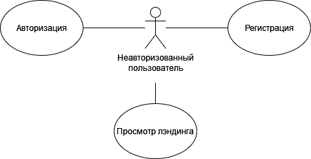
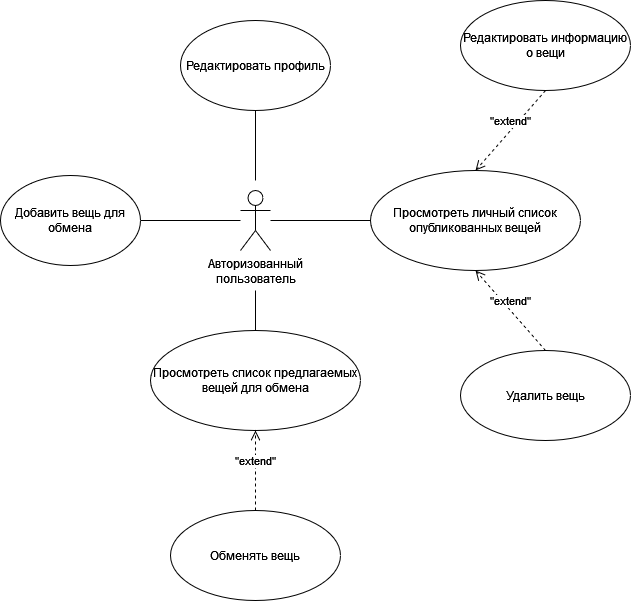
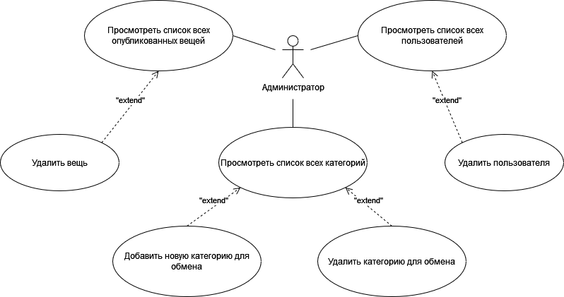

# Exchanger

Exchanger - веб-приложение для обмена вещей пользователей.

[Репозиторий с backend частью](https://github.com/pustart/exchanger-back-dsr)
***

## Требования к системе

- В системе должно быть 2 типа пользователей: обычные пользователи и администраторы.
- Список администраторов должен быть предопределен/генерироваться при разворачивании приложения.

Должны быть реализованы следующие страницы:

- Страница логина для пользователя.
- Пользователи должны иметь возможность регистрироваться. Форма регистрации должна представлять из себя пошаговый «квиз»:
  - Первый шаг. Логин, email, пароль, подтверждение пароля
  - Второй шаг. Имя, телефон, дата рождения, загрузка фотографии
  - Третий шаг.  Подтверждение введенных данных.

Для авторизованных пользователей должны быть реализованы следующие страницы:

- Страница со списком опубликованных пользователем вещей с возможностью удаления.
- Редактирование, Добавление вещи. Поля:
  - Название.
  - Фото.
  - Описание.
  - Категория.
  - Категория для обмена.
  - Местонахождение на карте.
- Страница со списком предложенных вещей (категория и категория для обмена совпали с категорией для обмена и категорией вещи другого пользователя).
- Редактирование своего профайла.

Для администраторов должны быть реализованы следующие страницы:

- Главная страница: содержит список вещей с возможностью удаления.
- Страница со списком пользователей с возможностью удаления.
- Страница со списком категорий с возможностью добавления и удаления.
- Все редактируемые поля должны иметь соответствующую валидацию.

## Дополнительно

- Добавить возможность зарегистрированному пользователю предложить обмен другому пользователю (соответсвующие категории должны совпасть).
- Реазизовать страницу со списком заявок для обмена от других пользователей. После принятия заявки обе вещи удаляются.
- Для всех списков должна быть реализована серверная пейджинация, фильтрация и сортировка. На стороне клиента «бесконечная» прокрутка.
- Реализовать продвинутое редактирование профиля и регистрацию: возможность обрезать и сжимать фотографии (аватарки, фото предмета), маска для телефона и email, дат (можно реализовать свой DatePicker)
- Добавить карусель последних просмотренных вещей/пользователей
- При желании добавить интеграцию с Google Maps или любым другим адресным API для добавления расположения вещей

## Реализация

**Управление разработкой**

- [Trello](https://trello.com/b/KiGeweH1/%D0%BF%D1%80%D0%B0%D0%BA%D1%82%D0%B8%D0%BA%D0%B0-dsr)
- [Miro](https://miro.com/app/board/uXjVM-8UYh8=/?share_link_id=866043680661)

***

**Frontend:**

- JavaScript
- CSS
- Next.js v13.4.5
- Redux
- Docker

***

**Backend:**

- TypeScript
- Nest.js v9.0.0
- Prisma ORM
- PostgreSQL
- Swagger
- Docker

## Диаграммы

### Диаграмма прецедентов неавторизованного пользователя

### Диаграмма прецедентов авторизованного пользователя

### Диаграмма прецедентов администратора

